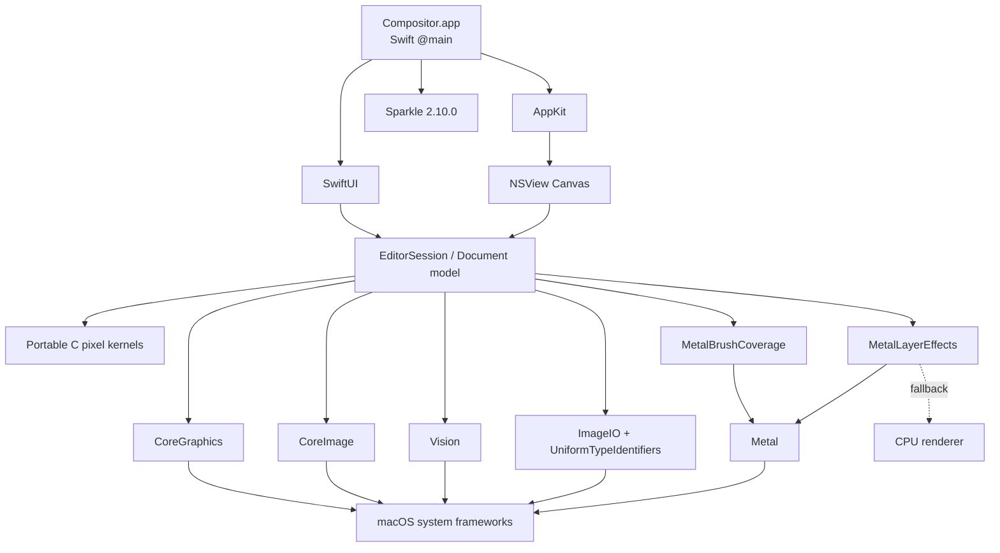
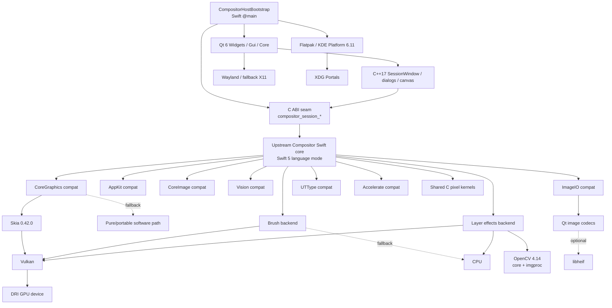
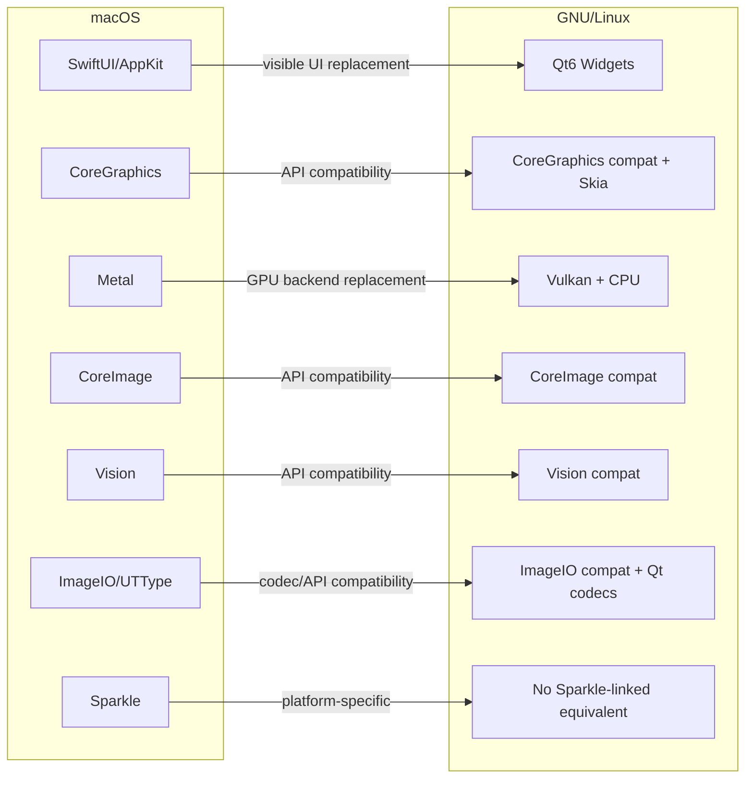

# macOS vs GNU/Linux — Dependency & Architecture Map

> Snapshot: canonical macOS `main` at `c9f8fad82b39e11d5a69df2c288a12defe057ba2`; GNU/Linux implementation source at `088a0d5a0d32d4d1dc0122b52e9b071bd9617600` (later docs-only commits do not change this dependency graph).
>
> This document describes **runtime/build architecture and library dependencies**, not UI parity. The macOS application means the Xcode target under `Compositor.xcodeproj` and sources under `Compositor/`; Linux-only support code that also happens to exist on `main` is not counted as a macOS application dependency.

## 1. Executive comparison

| Layer | macOS canonical app | GNU/Linux port | Relationship |
|---|---|---|---|
| Application shell | SwiftUI + AppKit | Qt 6 Widgets (`Qt6Widgets`, `Qt6Gui`, `Qt6Core`) | Replacement |
| App entry point | Swift `@main` (`CompositorApp`) | Swift `@main` bootstrap → C ABI → Qt host | Linux adds bridge |
| Main language | Swift 5 | Upstream Swift core in Swift 5 mode + C++17 host/backends + C11 kernels | Linux is polyglot |
| Window/widget system | AppKit / SwiftUI | Qt Widgets | Replacement |
| Canvas host | `NSView` / `NSViewRepresentable` | QWidget/QPainter shell + Swift-rendered image | Replacement |
| Graphics API | CoreGraphics | Linux `CoreGraphics` compatibility module, backed by Skia / fallback implementation | Compatibility layer |
| GPU brush | Metal | Vulkan brush backend, CPU fallback | Replacement |
| GPU layer effects | Metal, CPU fallback | Vulkan + OpenCV + CPU effects backend | Replacement/extension |
| Image filters | CoreImage + portable kernels | `CoreImage` compatibility surface + portable kernels / Linux backends | Compatibility layer |
| Subject/object analysis | Vision | `Vision` compatibility module | Compatibility layer |
| Image I/O | ImageIO + UTType | `ImageIO` + `UniformTypeIdentifiers` compatibility modules; Qt image codecs; optional libheif | Compatibility + replacement |
| SIMD/numerics | Accelerate where upstream uses it | `Accelerate` compatibility module | Compatibility layer |
| Portable pixel code | C kernels | Same upstream C kernels (`CompositorKernels`) | Shared source |
| Update framework | Sparkle 2.10.0 | No Sparkle dependency in Linux package | macOS-only |
| Packaging | Xcode `.app`, App Sandbox, Hardened Runtime | Flatpak | Platform-specific |
| Desktop runtime | macOS SDK/frameworks | KDE Platform 6.11 / Freedesktop 26.08 family | Platform-specific |
| GPU runtime | Metal | Vulkan (+ DRI device in Flatpak) | Replacement |

## 2. Version / toolchain table

| Item | macOS | GNU/Linux |
|---|---|---|
| Product version | 1.2.2 (build 17) | Branch port, built as Flatpak |
| Deployment/runtime target | macOS 26.5 | `org.kde.Platform//6.11` |
| Qt | — | Qt 6.11.2 through KDE SDK |
| Swift source language mode | Swift 5 | Swift 5 language mode for upstream code |
| Swift toolchain | Xcode toolchain | Freedesktop Swift extension; manifest documents Swift 6.3.3 |
| C | GNU/C17 project settings | C11 in CMake portable side |
| C++ | GNU++20 project setting | C++17 |
| Metal | system framework | — |
| Vulkan | — | linked by brush/effects backends |
| Skia | — | canvaskit/0.42.0, static, Vulkan/GL enabled |
| OpenCV | — | 4.14.0, static `core` + `imgproc` only |
| Sparkle | 2.10.0 | — |
| libheif | system ImageIO handles HEIF/HEIC path | optional host/Qt ImageIO dependency when available |

## 3. Apple framework → Linux implementation mapping

| macOS dependency | macOS role | Linux counterpart | Linux implementation status/type |
|---|---|---|---|
| SwiftUI | high-level UI, menus, controls | Qt Widgets for visible app UI; compatibility `SwiftUI` target for upstream source compilation | Replace + shim |
| AppKit | windows, NSView canvas, events, native controls | Qt Widgets; compatibility `AppKit` target for upstream core/API surface | Replace + shim |
| CoreGraphics | CGImage/CGContext/path/raster primitives | compatibility `CoreGraphics` target + Skia bridge / fallback | Shim/backend |
| Metal | brush coverage, layer effects | Vulkan C++ backends + CPU fallback | Replace |
| CoreImage | filters, image processing | compatibility `CoreImage` target plus Linux rendering/filter implementations | Shim/backend |
| Vision | subject/object segmentation APIs | compatibility `Vision` target | Shim/backend |
| ImageIO | JPEG/PNG/HEIC/TIFF decoding/encoding | compatibility `ImageIO`; Qt6 GUI image plugins; optional libheif | Shim/backend |
| UniformTypeIdentifiers | file/media type identifiers | compatibility `UniformTypeIdentifiers` target | Shim |
| Accelerate | numeric/image primitives | compatibility `Accelerate` target | Shim/portable impl |
| CoreVideo | image buffer types touched by upstream APIs | compatibility `CoreVideo` target | Shim |
| Foundation | files, URLs, concurrency/runtime facilities | Swift corelibs Foundation + `FoundationCompat` for missing Apple APIs | Native Linux Swift + shim |
| Sparkle | app updates | no linked Linux equivalent | macOS-only feature dependency |

## 4. GNU/Linux direct and important transitive dependencies

| Dependency | Why it exists | How it enters |
|---|---|---|
| Qt6 Widgets | main visible desktop UI | `HostRun` / host executable |
| Qt6 Gui | QPainter, QImage, codecs, input/graphics | Qt host + ImageIO backend |
| Qt6 Core | object/event/runtime foundation | Qt host |
| Vulkan | GPU compute/render backend for brush/effects and Skia GPU path | C++ backends / Skia bridge |
| Skia | CoreGraphics-compatible raster/path/render backend | `CompositorSkiaBridge` |
| Skia PathOps | CGPath boolean operations | `libskia_pathops.a` beside Skia |
| OpenCV core | matrix/image primitives | effects/OpenCV bridge |
| OpenCV imgproc | selected image operations/effects | effects/OpenCV bridge |
| libheif | HEIF/HEIC/AVIF codec path when header/library exists | `QtImageIO.cpp` conditional link |
| Swift static runtime | runs upstream Swift core inside Linux app | Flatpak `swift build --static-swift-stdlib` |
| zlib | OpenCV/static Foundation-related support | linked transitively/explicitly |
| pthread | Skia/OpenCV/runtime support | explicit/static native deps |
| dl | dynamic loading and native runtime support | explicit native dep |
| libm | portable C pixel kernels | `CompositorKernels` |
| curl, sqlite3, xml2 | pulled by statically embedded Swift Foundation runtime in CMake final-link path | runtime support |
| XDG portals | file chooser/documents/clipboard integration in sandbox | Flatpak DBus portal access |
| Wayland / fallback X11 | window-system transport | Flatpak sockets / Qt platform plugins |
| DRI | GPU device access | Flatpak `--device=dri` |

## 5. macOS dependency graph



## 6. GNU/Linux dependency graph



## 7. Cross-platform correspondence graph



## 8. Architectural cost / coupling matrix

Legend: **Low** = same source or thin mapping; **Medium** = compatibility implementation must track Apple semantics; **High** = separate UI/backend implementation with significant parity risk.

| Area | macOS coupling | Linux extra machinery | Parity/maintenance risk |
|---|---|---|---|
| Document/model logic | Swift core | upstream core reused | Low–Medium |
| Portable pixel kernels | C source | same C source | Low |
| UI hierarchy & interaction | SwiftUI/AppKit | Qt Widgets reimplementation | **High** |
| Native controls/menu behavior | AppKit | Qt behavior emulation | **High** |
| CoreGraphics drawing | native framework | compatibility API + Skia/fallback | Medium–High |
| Brush GPU | Metal | Vulkan/CPU | Medium |
| Layer effects GPU | Metal/CPU | Vulkan/OpenCV/CPU | Medium–High |
| Filters | CoreImage | compat/backend path | Medium–High |
| Vision features | Apple Vision | compatibility implementation | **High** for semantic equivalence |
| Image codecs | ImageIO | Qt codec backend + optional libheif | Medium |
| File dialogs/sandbox | AppKit sandbox APIs | Flatpak + XDG portals | Medium, platform-owned differences |
| Update mechanism | Sparkle | no current linked counterpart | Intentional platform difference / gap |

## 9. Runtime stack — simplified vertical view

### macOS

```text
Compositor.app
└─ SwiftUI / AppKit UI
   └─ EditorSession + Document model
      ├─ CoreGraphics / CoreImage / ImageIO / Vision / Accelerate
      ├─ Metal brush + Metal layer effects
      └─ Shared portable C pixel kernels

External package: Sparkle 2.10.0
Platform: macOS SDK, App Sandbox, Hardened Runtime
```

### GNU/Linux

```text
Flatpak: KDE Platform 6.11
└─ Swift @main bootstrap
   ├─ Qt6 Widgets / Gui / Core desktop shell
   │  └─ C++ SessionWindow / dialogs / canvas
   │     └─ C ABI (compositor_session_*)
   └─ Upstream Swift Compositor core
      ├─ Apple-API compatibility modules
      │  ├─ CoreGraphics → Skia / portable fallback
      │  ├─ ImageIO → Qt codecs → optional libheif
      │  ├─ AppKit / SwiftUI API surfaces
      │  ├─ CoreImage / Vision / Accelerate / CoreVideo / UTType
      │  └─ FoundationCompat
      ├─ Brush → Vulkan / CPU
      ├─ Effects → Vulkan / OpenCV / CPU
      └─ Shared portable C pixel kernels

Platform integration: XDG portals + Wayland/X11 + DRI
```

## 10. Key conclusions

1. **The reusable domain/core layer is the strongest common denominator.** The Linux package intentionally compiles the upstream `Compositor/{Document,IO,Rendering}` logic through `Sources/UpstreamCore` rather than independently rewriting the editor model.
2. **The visible UI is not shared.** macOS is SwiftUI/AppKit; Linux is Qt Widgets. This is the largest UI/UX parity surface.
3. **Apple framework names on Linux do not mean Apple frameworks are present.** `CoreGraphics`, `AppKit`, `CoreImage`, `Vision`, `ImageIO`, etc. are Linux compatibility targets exposing API surfaces required by upstream Swift.
4. **GPU architecture differs fundamentally.** macOS uses Metal directly; Linux uses Vulkan (plus CPU fallback), with Skia providing a major graphics compatibility backend and OpenCV supplementing selected effects/operations.
5. **Linux has substantially more dependency edges.** This is expected for a compatibility port: Qt supplies desktop UI, Skia/compat modules replace Apple graphics APIs, Vulkan replaces Metal, and Flatpak/portals replace App Sandbox integration.
6. **Dependency parity is not binary parity.** The target is equivalent application behavior and output, not identical platform libraries.

## 11. Source anchors

- macOS application entry/UI: `Compositor/CompositorApp.swift`, `Compositor/Rendering/EditorCanvas.swift`
- macOS Metal: `Compositor/Rendering/MetalBrushCoverage.swift`, `Compositor/Rendering/MetalLayerEffects.swift`
- macOS image frameworks: `Compositor/Document/Filters.swift`, `Compositor/Document/SubjectRemoval.swift`, `Compositor/IO/ImageImporter.swift`, `Compositor/IO/ImageExporter.swift`
- macOS third party: `Compositor.xcodeproj/.../Package.resolved` (Sparkle)
- Linux dependency composition: `Package.swift`
- Linux native/link topology: `CMakeLists.txt`
- Linux runtime/package pins: `com.wonderassembly.Compositor.yaml`
- Linux desktop shell: `host/SessionWindow.cpp`, `host/host_run.cpp`
